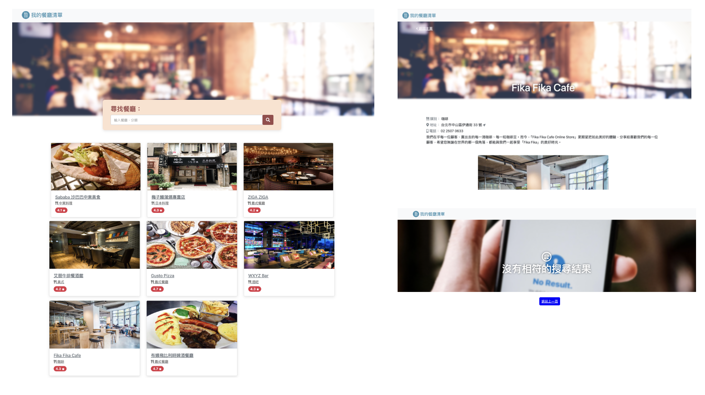

### About The Project
This is a restaurant website that let user browse restaurant list and search restaurant by name & type.

### Built With
- Node.js
- Express(Express-handlebars)
- Bootstrap
- Fontawesome

### Function
- Browse : User can browse restaurant list and restaurant detail by clicking restaurant cards
- Search : User can search restaurant by name & type

### How to Use:
- 1. clone git :https://github.com/clairehuang77777/restaurantList.git
- 2. cd your-repo
- 3. install npm, express, express-handlebar
- 4. "npm run dev" to run the server
- 5. Browse http://localhost:3000/ to see restaurant website

